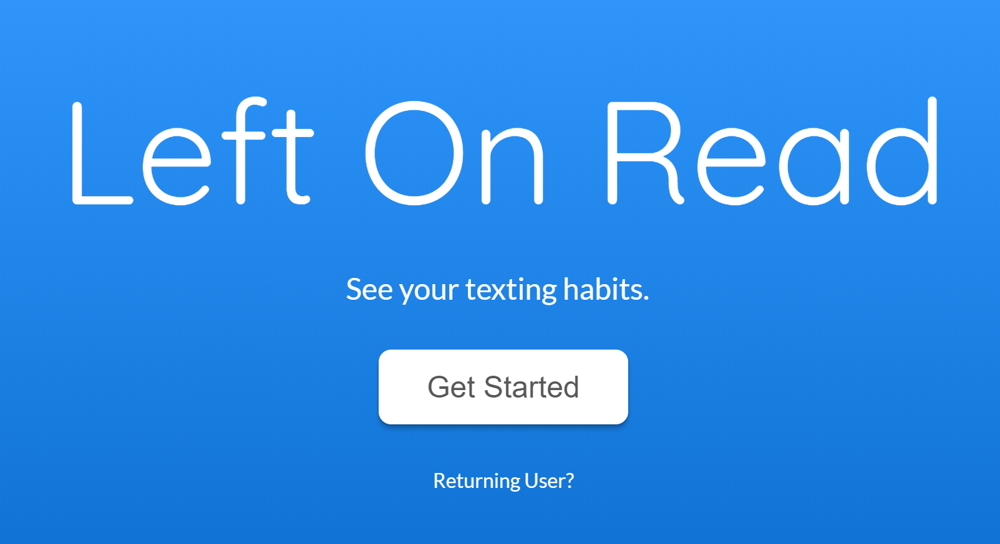
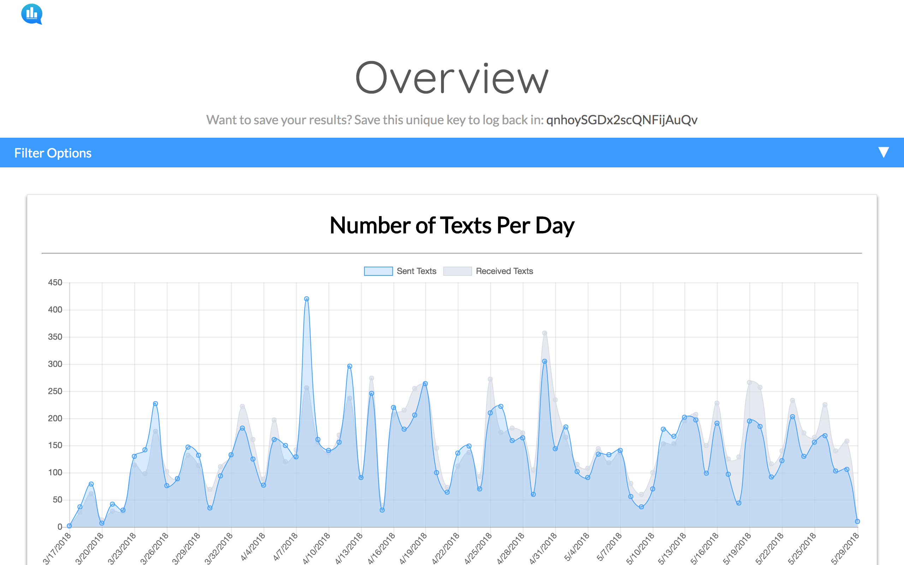
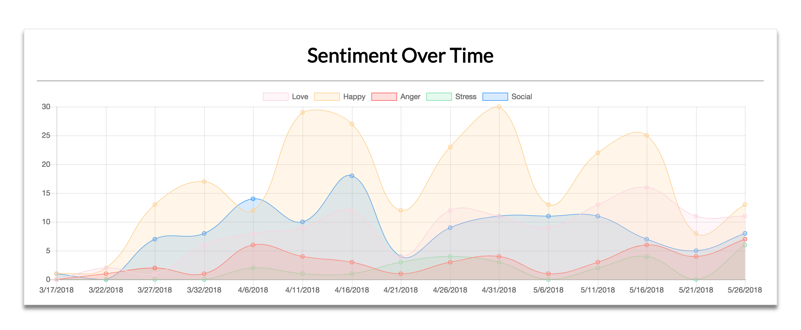
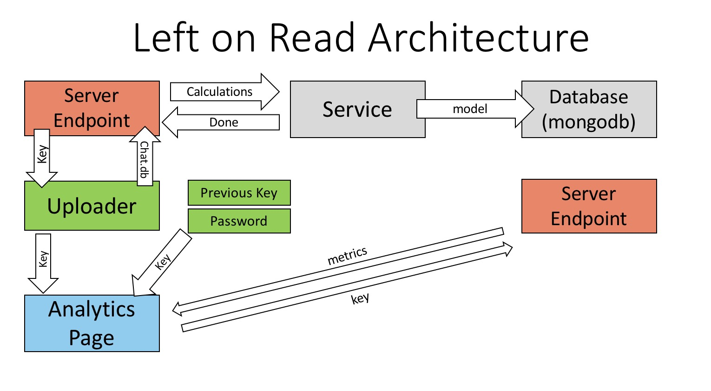

#  Left On Read

A web iMessage Analyzer. Analyze your texts. Learn who your friends are.

Check us out at [https://leftonread.me/](https://leftonread.me/)



## What is Left On Read?

Left On Read provides statistical data about your texting habits. 

It gives you the platform to quickly and effortlessly analyze your texts and discover new insights about yourself, your contacts, and your relationships. With comprehensive analytical tools, beautiful and intuitive visuals, and agile filtering options, we give you complete control to manipulate and examine your data, your way. Daily texting history, top 5 words, sentiment analysis, and so much more - all available at your fingertips.

What word do you text the most? Favorite emoji? Top 5 friends? Do you text people more than they text you? Left On Read answers these questions.



What word do you text the most? Favorite emoji? Top 5 friends? Do you text people more than they text you? Left On Read answers these questions.



We don't tell the story. We let your data tell the story.


## User Flow

#### Starting Out

From the landing page, the user navigates to the uploader, where they are given instructions to upload their `chat.db` file and optionally upload a `.vcf` to match their contacts. On upload, the user can can also add a password. After these modals, the user is taken to the loader while the data is parsed and analyzed.

#### Overview

The user is then taken to the Overview page, where they are able to explore their data and graphs. At the top of the page will be an instance key, that can be used to return to the user's output, without needing to upload their chat.db or contacts again. At the top, there is also a filter bar that allows the user to filter by time and conversation. Users also have the option to share their graphs, but their key also lasts 48 hours.

#### Returning User

With their saved instance key and password (if they decided to add a password), the user is able to access a previous session and see the analytics again.

## Design and Styling:

Left On Read's design is influenced by modern, minimalist trends. With our user flow, we aimed to create a simple and intuitive website that encourages user exploration. 


The current styles sheets are (for the most part) divided into specific pages of the website. A general style sheet called `style.scss` also contains mthe ain component styles that are used across the website.


## Architecture

Currently, Left On Read works only with iMessages stored on macOS.



#### General Overview of Components:

* Landing Page
* Uploader
* Analytics (Overview)
  + Graph Wrapper (all graphs)
  + Graph Card (unfocused)
  + Graph Modal (focused)
  + Graph Loader
  + Graphs directory has each graph component

* Graphs:
    + Average text length (Bar)
    + Reconnect with friends (Bar)
    + Sentiment (Doughnut)
    + Sentiment over time (Line)
    + Texts per day (Line)
    + Top five friends (Bar)
    + Top five words (Bar)
    + Total texts (Doughnut)

* Filter
    + Option to filter by conversation or by time
* Loading Page
  + iMessage Conversation
  + Countdown
+ Key Return

#### Data visualization:

* React chart.js 2 component wrapper found on [GitHub](https://github.com/jerairrest/react-chartjs-2).

#### Data storage:

* Check out the server repo [here](https://github.com/dartmouth-cs52-18S/server-left-on-read).

#### Redux

We do take advantage of Redux to ensure our data is consistent throughout the platform. Our Redux store contains the following reducers:

````
Instance: Stores the current instance the user is accessing
Metrics: Stores what metrics are expected given what page the user is currently on
Error: If the server returns with an error, this is to notify whichever page the user is on
FullData: The data returned from gathering the metrics.
Filters: What filters are currently being applied
````

Hence, we have the following actions:

````
export const ActionTypes = {
  LOAD_KEY: 'LOAD_KEY',
  LOAD_INSTANCE: 'LOAD_INSTANCE',
  UPLOAD_ERR: 'UPLOAD_ERR',
  TOTAL_TEXTS: 'TOTAL_TEXTS',
  TEXTS_PER_DAY: 'TEXTS_PER_DAY',
  ERROR: 'ERROR',
  EXPECTED_METRICS: 'EXPECTED_METRICS',
  GRAPH_DATA: 'GRAPH_DATA',
  ALL_NUMBERS: 'ALL_NUMBERS',
  RESET_STATE: 'RESET_STATE',
  WORD_FILTER: 'WORD_FILTER',
  SENTIMENT: 'SENTIMENT',
  RECONNECT: 'RECONNECT',
  UPDATE_FILTER: 'UPDATE_FILTER',
};

````

# How to get setup and do testing:

Clone this repo. And then grab the server server repo, too.

### Dependencies:

Dependencies can be found in the package.json.

To install dependencies, run:

`yarn`

To run the client:

- `yarn start`

This should appear:

```bash
yarn run v1.7.0
$ NODE_ENV=development webpack-serve ./webpack.config.js
ℹ ｢hot｣: webpack: Compiling...
ℹ ｢hot｣: WebSocket Server Listening at localhost:8081
ℹ ｢serve｣: Project is running at http://localhost:8080
ℹ ｢serve｣: Server URI copied to clipboard
```

If it compiles successfully, you'll see:

`ℹ ｢wdm｣: Compiled successfully.`

Be sure to start the server as well. Read about the server setup in our server repo.

Then go to localhost:8080 in your browser (currently we work best with Chrome).

You are now running Left On Read! Test as you please.

### Deployment

Travis CL is setup on both the server repo and the client repo. Therefore, Left On Read master branch deploys automatically to [leftonread.me](https://leftonread.me/).

## Authors

Alexander Danilowicz, Teddy Ni, Braden Pellowski, Thomas Kim, Weiling Huang, Justin Luo

Contact us at alex.19@dartmouth.edu

## Acknowledgments
* Thank you to [Tim Tregubov](https://home.dartmouth.edu/faculty-directory/tim-tregubov) for guidance and wisdom.
* Course materials from [CS52 Dartmouth](http://cs52.me/).
* Amazing react wrapper by jerairrest: [react-chart-js-2](https://github.com/jerairrest/react-chartjs-2)